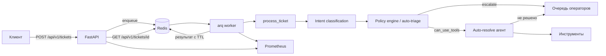

# Автоматизация обработки тикетов службы поддержки

Агент на LLM, который классифицирует обращения, решает типовые проблемы через
инструменты и передаёт сложные случаи операторам вместе с контекстом.

Сервис состоит из HTTP API, фонового воркера и Redis. Обработка вынесена из
HTTP-цикла: приём обращения не зависит от латентности модели.

## Архитектура



Этапы обработки соответствуют
[bot/pipeline.py](bot/pipeline.py):

1. **Intent classification** — [bot/classifier.py](bot/classifier.py).
   Структурированный вывод модели с честной оценкой уверенности.
2. **Auto-triage** — [bot/policy_engine.py](bot/policy_engine.py).
   Детерминированные правила: приоритет, очередь, разрешение на инструменты.
3. **Auto-resolve** — [bot/ticket_resolver.py](bot/ticket_resolver.py).
   Агент с инструментами: сброс пароля, статус заказа, поиск по базе знаний.
4. **HITL escalation** — любой отказ приводит к эскалации с указанием причины,
   а не к исключению наружу.

### Ключевые решения

**Решение принимает не модель, а policy engine.** Правила детерминированы,
покрыты тестами и не тратят бюджет латентности на дополнительный вызов LLM.
Порог уверенности задаётся только в одном месте — `CONFIDENCE_THRESHOLD`.

**Тикет закрывается по факту действия, а не по отсутствию ошибок.** Ответ агента
без успешного вызова результирующего инструмента считается нерешённым и уходит
оператору. Соответствие «намерение → инструмент» задано в
`RESOLVING_TOOL_BY_INTENT` ([bot/contracts.py](bot/contracts.py)).

**Результат вызова инструментов отслеживается структурно.** Инструменты пишут
`ToolCallRecord` в контекст исполнения; разбор текста сообщений не используется.

**Единые контракты.** Статусы, очереди, приоритеты и причины эскалации —
перечисления в [bot/contracts.py](bot/contracts.py). Метрики и API используют их
же, поэтому наборы значений не расходятся между модулями.

## Требования продакшена

| Требование (spec) | Реализация |
| --- | --- |
| Latency budget (§31) | `Deadline` на весь тикет плюс потолок на шаг, [bot/resilience.py](bot/resilience.py) |
| Fallback при недоступности модели (§32) | Circuit breaker с состоянием в Redis, общим для реплик |
| Защита PII (§33) | Маскирование в логах и трейсах, [observability/pii.py](observability/pii.py) |
| Идемпотентность инструментов (§34) | Ключи в Redis, [bot/idempotency.py](bot/idempotency.py) |
| Rate limiting (§35) | Лимит на вызовы LLM и на входящие запросы API |
| Отказоустойчивость (§36) | Реплики воркера, деградация базы знаний, эскалация вместо зависания |

Отдельно стоит отметить два момента, обнаруженных при проверке.

`ChatOpenRouter` принимает `timeout` в **миллисекундах** и по умолчанию включает
собственные ретраи длительностью до 150 секунд на попытку. И то, и другое ломает
бюджет в 10 секунд, поэтому в [bot/llm.py](bot/llm.py) таймаут конвертируется, а
встроенные ретраи отключены в пользу `retry_async` под общим дедлайном.

Таймаут HTTP-клиента срабатывает не во всех сценариях (проверено на «молчащем»
соединении), поэтому каждый шаг дополнительно ограничен через `Deadline.run`.
Превышение лимита шага при живом бюджете трактуется как отказ зависимости и
учитывается circuit breaker-ом; исчерпание бюджета тикета — нет.

### Латентность reasoning-моделей

GPT-5 тратит на внутренние размышления секунды, и при `effort` уровня `medium` и
выше один вызов со структурированным выводом регулярно не укладывается в 8
секунд. В сумме с циклом агента бюджет в 10 секунд из spec §31 недостижим:
тикеты штатно, но бесполезно уходят оператору с `reason: timeout` и пустым
`usage` — ответа от модели не было, токены не потрачены.

Поэтому `LLM_REASONING_EFFORT` по умолчанию `minimal`. Если этого мало, есть три
рычага, в порядке предпочтения:

1. Поднять `TICKET_DEADLINE_SECONDS` до 30–45 секунд. Обработка асинхронная,
   клиент опрашивает `poll_url` и синхронно никто не ждёт, поэтому жёсткие 10
   секунд здесь не самоцель. Вместе с ним поднимите
   `LLM_REQUEST_TIMEOUT_SECONDS`, иначе потолок шага сработает раньше.
2. Взять на классификацию отдельную быструю модель. Задача простая, reasoning
   для неё избыточен. Потребует таблицы цен на модель, сейчас цена одна общая.
3. Убрать отдельный шаг классификации, сделав её первым обязательным вызовом
   инструмента внутри агента: минус один последовательный вызов модели.

## Запуск

### Docker Compose

```bash
cp .env.example .env          # укажите OPENROUTER_API_KEY
docker compose up --build
```

Поднимаются API (`:8000`), два воркера, Redis, Prometheus (`:9090`) и
Grafana (`:3000`, логин `admin`) с преднастроенным дашбордом.

### Локально

```bash
uv sync
cp .env.example .env
docker run -d -p 6379:6379 redis:7-alpine

uv run uvicorn app.main:app --reload      # API
uv run arq worker.main.WorkerSettings     # воркер
```

Обработка одного обращения без сервиса:

```bash
uv run python main.py "Забыл пароль от аккаунта"
```

### Тесты

```bash
uv run pytest
```

## API

| Метод | Путь | Назначение |
| --- | --- | --- |
| `POST` | `/api/v1/tickets` | Принять обращение, вернуть `ticket_id` и ссылку для опроса |
| `GET` | `/api/v1/tickets/{ticket_id}` | Результат обработки: `200` готов, `202` в работе, `404` неизвестен |
| `GET` | `/health/live` | Процесс жив |
| `GET` | `/health/ready` | Готовность: доступность Redis и состояние circuit breaker |
| `GET` | `/metrics` | Метрики Prometheus |

```bash
curl -X POST http://localhost:8000/api/v1/tickets \
  -H 'Content-Type: application/json' \
  -d '{"text": "Забыл пароль от аккаунта"}'

curl http://localhost:8000/api/v1/tickets/T-ab12cd34ef56
```

Повторная отправка с тем же `ticket_id` не создаёт вторую задачу: постановка в
очередь идемпотентна.

## Наблюдаемость

Воркер отдаёт метрики на порту `WORKER_METRICS_PORT` (по умолчанию `9001`), API —
на `/metrics`.

| Метрика | Назначение |
| --- | --- |
| `support_tickets_received_total` | Знаменатель для доли автоматизации |
| `support_tickets_processed_total` | Разбивка по итоговому статусу |
| `support_tickets_escalated_total` | Эскалации по причинам |
| `support_ticket_handle_time_seconds` | Время обработки, контроль SLA |
| `support_ticket_cost_rubles` | Стоимость: LLM, инфраструктура, итого |
| `support_llm_tokens_total` | Потребление токенов по шагам |
| `support_circuit_breaker_state` | 0 закрыт, 1 полуоткрыт, 2 разомкнут |
| `support_tool_calls_total` | Вызовы инструментов и их исход |
| `support_idempotent_replays_total` | Подавленные повторы действий |

Доля автоматических разрешений считается запросом Prometheus, а не в приложении:
gauge, усреднённый за время жизни процесса, вводит в заблуждение. Правила записи
и алерты — в [docker/prometheus/rules.yml](docker/prometheus/rules.yml).

Логи содержат correlation id (`ticket=...`) и проходят через PII-фильтр.
Трейсинг LangSmith по умолчанию выключен: payload содержит персональные данные.

## Калибровка порога уверенности

Порог автоматической обработки подбирается на размеченной выборке, а не
угадывается:

```python
from bot.calibrate import calibrate_confidence_threshold

report = await calibrate_confidence_threshold(
    [("Забыл пароль", "password_reset"), ...],
    min_precision=0.9,
)
```

Полученное значение записывается в `CONFIDENCE_THRESHOLD`.

## Конфигурация

Все параметры задаются переменными окружения, полный список с комментариями —
в [.env.example](.env.example). Основные:

| Переменная | По умолчанию | Назначение |
| --- | --- | --- |
| `OPENROUTER_API_KEY` | — | Ключ доступа к модели, обязателен |
| `LLM_MODEL` | `openai/gpt-5` | Модель; архитектура допускает замену |
| `LLM_REASONING_EFFORT` | `minimal` | Объём размышлений, главный рычаг латентности |
| `TICKET_DEADLINE_SECONDS` | `10` | Бюджет времени на обращение |
| `LLM_REQUEST_TIMEOUT_SECONDS` | `8` | Потолок на один вызов модели |
| `CONFIDENCE_THRESHOLD` | `0.7` | Порог автоматической обработки |
| `BREAKER_FAILURE_THRESHOLD` | `5` | Ошибок до размыкания breaker |
| `LLM_REQUESTS_PER_SECOND` | `5` | Лимит обращений к модели |
| `REDIS_URL` | `redis://localhost:6379/0` | Очередь, результаты, состояние |

## Структура проекта

```
bot/            доменное ядро: пайплайн, классификатор, policy engine, агент
  contracts.py  перечисления и модели результата — общий контракт слоёв
  resilience.py дедлайн, circuit breaker, ретраи
  idempotency.py ключи идемпотентности инструментов
app/            HTTP API на FastAPI
worker/         фоновый воркер arq
observability/  метрики, логирование, маскирование PII, стоимость
data/           база знаний
docker/         образы, конфигурация Prometheus и Grafana
tests/          тесты
```

## Что осталось за рамками

База знаний работает на локальном индексе по ключевым словам. Класс
`KnowledgeBase` ([bot/knowledge_base.py](bot/knowledge_base.py)) описывает
контракт, к которому подключается векторное хранилище без изменений в
вызывающем коде; graceful degradation при его недоступности уже реализована.

Результаты хранятся в Redis с TTL. Для аудита и аналитики за пределами суток
понадобится постоянное хранилище (PostgreSQL) — контракт `TicketResult`
переносится в таблицу без изменений.

Изменение адреса доставки распознаётся, но инструмента для него нет, поэтому
такие обращения всегда уходят оператору.
